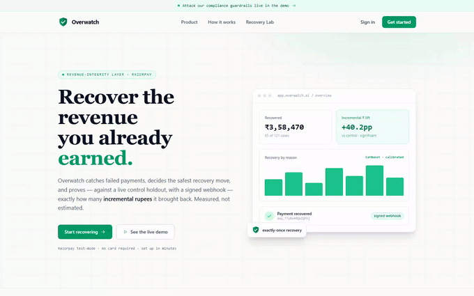
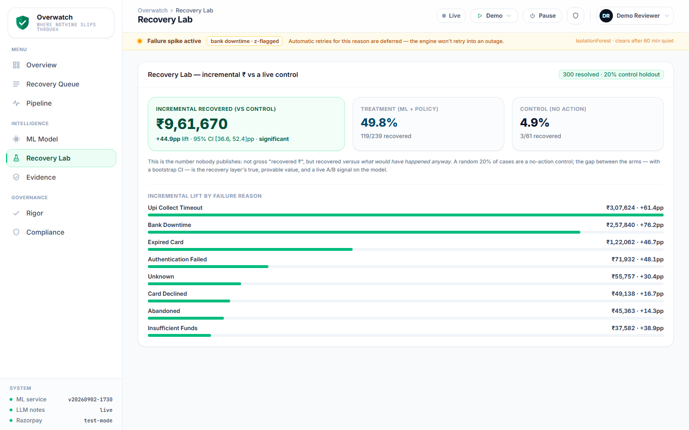
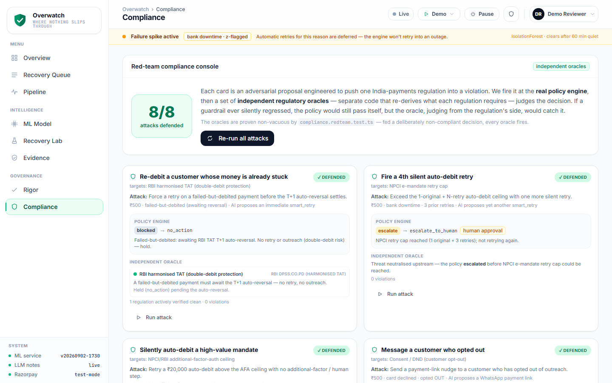
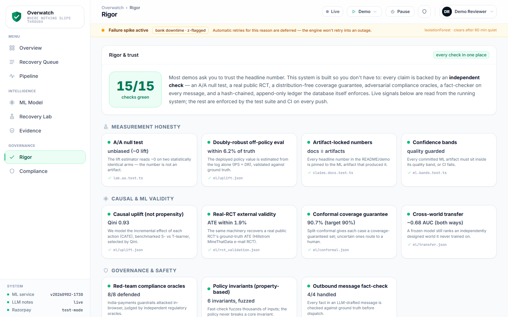

# Overwatch — Where Nothing Slips Through

[](https://overwatch-web.happytree-e373af54.uaenorth.azurecontainerapps.io)
[](docs/assets/overwatch-demo.mp4)
[](.github/workflows/ci.yml)
[](#honesty-guards--enforced-in-ci-on-every-push)
[](docs/PROOF.md#money-path)
[](#mapped-to-track-03s-bar)

> **Bounded, ML-first revenue recovery for Razorpay.** Recover the revenue you already earned. Overwatch detects failed payments and abandoned checkouts, uses **calibrated
> machine-learning models** to decide the safest recovery move and how likely it is to work, executes it with **real
> Razorpay payment links** under hard policy limits, and proves — with a **signed webhook round-trip** — exactly how
> much money it brought back.

**Razorpay AI Buildathon 2026 · Track: AI Revenue Recovery**

---

## Judge this in 60 seconds

- **What it does.** Catches failed Razorpay payments and abandoned checkouts, decides the safest recovery action with calibrated ML, executes it under a deterministic policy engine, and measures *incremental* ₹ against a randomised 20% no-action control, with a 95% CI.
- **The one number.** On the real Hillstrom 64,000-customer RCT, our causal machinery recovers the trial's ground-truth ATE to within 1.9% — an e-mail RCT, so it validates the estimator, not payment recovery itself; every in-world ML figure below is on a synthetic world we built and disclose on each artifact.
- **The one command.** `./reproduce.sh` rebuilds every number, and `claims.docs` fails CI if this README ever drifts from its artifacts. Every claim → artifact → test → endpoint: [`docs/PROOF.md`](docs/PROOF.md).



**📹 Full 4-minute demo video → [`docs/assets/overwatch-demo.mp4`](docs/assets/overwatch-demo.mp4)** — the complete tour: landing → onboarding → every dashboard page. (The looping GIF above is a quick teaser.)

**▶ Live demo:** **[overwatch-web.happytree-e373af54.uaenorth.azurecontainerapps.io](https://overwatch-web.happytree-e373af54.uaenorth.azurecontainerapps.io)** _(Azure Container Apps · UAE North)_ &nbsp;·&nbsp; **Run it yourself:** [`./reproduce.sh`](reproduce.sh) or the [Quickstart](#quickstart) &nbsp;·&nbsp; **Deploy:** [`docs/DEPLOY.md`](docs/DEPLOY.md) &nbsp;·&nbsp; **Re-record this walkthrough:** `node web/e2e/walkthrough.mjs` (Playwright → `docs/assets/walkthrough.gif`)

### Three results to check first — one of them is a loss

| Question | Result | Check |
|---|---|---|
| Does treatment beat a randomised no-action control? | Measured live on the running system — the Lab shows the whole 95% CI per reason and prints "not yet significant" when it isn't | `/app/lab` · `lab.aa.test.ts` |
| Does the causal uplift policy beat rules-only and always-retry? | Yes — it captures ~99% of the oracle's incremental ₹ against known ground truth (synthetic world) | `ml/uplift.json` |
| Does the uplift *ranking* hold on data we didn't generate? | Yes — on the real Hillstrom RCT, targeting the x-learner's top-30% yields +2.0pp more uplift than treating everyone (S-learner +2.5pp) over a +6.1pp ATE; all three learners beat random by Qini | `ml/rct_validation.json` |
| Does the online Thompson sampler beat the deterministic rules? | **No.** It reaches ~93% of oracle learning from nothing — and still trails the rules. Reported, not tuned away | `ml/explore.json` |

**Reviewer paths:** verify every number → [`docs/PROOF.md`](docs/PROOF.md) · attack the guardrails → [Compliance](https://overwatch-web.happytree-e373af54.uaenorth.azurecontainerapps.io/app/compliance) · see the real capture → [Evidence](https://overwatch-web.happytree-e373af54.uaenorth.azurecontainerapps.io/app/evidence) · the math → [ML Model](https://overwatch-web.happytree-e373af54.uaenorth.azurecontainerapps.io/app/model) · the hard questions → [`docs/DEFENSE.md`](docs/DEFENSE.md) · what broke → [`POSTMORTEM.md`](POSTMORTEM.md)

---

## Mapped to Track 03's bar

Track 03 asks for an agent that detects revenue at risk, diagnoses it, decides a bounded recovery action, executes it against Razorpay, and measures what it actually recovered — safely and auditably. Where each requirement lives here, and what proves it:

| Track 03 asks for | What Overwatch ships | Where | Proof |
|---|---|---|---|
| **Detect** failed payments & abandoned checkouts | Signed Razorpay webhooks + CSV + demo ingestion, normalised and **de-duplicated** (idempotent on `dedupeKey`); deterministic risk/urgency scoring before any model | `server/src/ingestion/`, `domain/scoring.ts` | `webhooks.moneypath.test.ts` (exactly-once) |
| **Diagnose** why it failed | Razorpay's own fault taxonomy (customer / bank / business / other) → recovery-path tag; per-case **SHAP reason codes** from the recovery model | `domain/reasons.ts`, ML `/explain` | any case page → *Why this decision* |
| **Decide** a bounded recovery action | CatBoost decides (calibrated recovery probability, next-best action, per-action uplift, escalation risk); a **deterministic policy engine disposes** — it can override, block or require a human | `pipeline/`, `domain/policy.ts` | `policy.chaos.test.ts` (property invariants), red-team **8/8** |
| **Execute** via Razorpay (test mode) | Real Payment Links + smart retry + reminders through an **allow-listed executor**; no model ever touches money | `domain/executor.ts`, `integrations/razorpay.ts` | `live-captures.json` + `npm run replay:roundtrip` |
| **Track outcomes & measure recovered revenue** | A signed `payment.captured` flips the case; the **Recovery Lab** reports *incremental* ₹ vs a randomised control with a 95% CI, per reason, and auto-suppresses reasons that can't beat control | `domain/lab.ts`, `/app/lab` | `lab.aa.test.ts` (A/A null), live `GET /api/lab` |
| **Bounded, safe, auditable AI** | India policy-as-code (RBI-TAT, NPCI retry cap, AFA ceiling, DND/quiet hours), kill switch, **LLM off the money path** (explain/draft only, fact-checked), hash-chained **append-only** ledger | `domain/audit.ts`, `domain/killswitch.ts`, `ai/` | `audit.chain.test.ts`, live forensics **4/4**, DB append-only probe |
| **Handle a live incident** | IsolationForest failure-spike detection defers retries into an outage | `domain/incidents.ts` | *Demo → Trigger failure spike* |

## Reproduce every number

**One command, in-process:** `cd server && npm run prove` re-derives the claims below from code and artifacts and prints PASS / FAIL with the observed values (the real captures, ledger forensics, A/A null + A/B power, the 20% holdout, the red-team defence, the message fact-checker, the ML bands, the doc-locked numbers, the pre-registered pilot). Point `SELFTEST_BASE` at the hosted URL and it proves the live system as well. A check that cannot run is printed as NOT RUN with the reason, never skipped.

| Claim | Value | Command | Artifact / guard |
|---|---|---|---|
| Causal uplift ranks by incremental effect | Qini ≈ 0.93 · ECE ≈ 0.008 · ~99% of oracle ₹ | `ml/.venv/Scripts/python ml/src/uplift.py` | `ml/uplift.json` · `claims.docs`, `ml.bands` |
| Doubly-robust OPE, from the log alone | ₹3,276/case (logging ₹2,442) · within ~6% of truth | same | `ml/uplift.json` · `claims.docs` |
| Real-RCT external validity (Hillstrom, 64,000 customers) | ATE +6.1pp recovered within 1.9% · ranking holds: top-30% targeting +2.0pp over the ATE (x-learner; S-learner +2.5pp) | `ml/.venv/Scripts/python ml/src/rct_validate.py` | `ml/rct_validation.json` · `claims.docs` |
| Conformal per-case guarantee | target 90% · empirical 90.7% | `ml/.venv/Scripts/python ml/src/conformal.py` | `ml/conformal.json` · `claims.docs`, `ml.bands` |
| Cross-world transfer | ROC-AUC ≈ 0.68 both ways | `ml/.venv/Scripts/python ml/src/transfer.py` | `ml/transfer.json` · `ml.bands` |
| Live incremental lift + 95% CI | *live* | Demo: Seed → Run pipeline → Advance retries → Resolve outcomes · `GET /api/lab` | `lab.aa.test.ts` |
| Real Razorpay round-trip | 2 captures → 2 recovered cases | `npm run replay:roundtrip` | `server/fixtures/razorpay/live-captures.json` |
| Exactly-once money path | 6 concurrent redeliveries → 1 recovery | `npm test` | `webhooks.moneypath.test.ts` |
| Tamper-evidence + DB append-only | 4/4 tampers caught · `UPDATE`/`DELETE` rejected | `GET /api/audit/forensics` | `audit.chain.test.ts` · live probe |
| Red-team compliance | 8/8 defended by independent oracles | `/app/compliance` → *Re-run all attacks* | `compliance.redteam.test.ts` |
| Everything above | — | [`./reproduce.sh`](reproduce.sh) | CI, every push |

Full evidence stack, with what each row proves: [`docs/PROOF.md`](docs/PROOF.md).

**Three ways to falsify this README:** (1) run [`./reproduce.sh`](reproduce.sh) — any number that no longer matches its artifact fails `claims.docs`; (2) run `npm run replay:roundtrip` — if the real capture doesn't recover a case, the money path is a story; (3) open [Compliance](https://overwatch-web.happytree-e373af54.uaenorth.azurecontainerapps.io/app/compliance) → *Re-run all attacks* and [Evidence](https://overwatch-web.happytree-e373af54.uaenorth.azurecontainerapps.io/app/evidence) → forensics — if a guardrail or the ledger fails live, the governance claim is false.

## Honesty guards — enforced in CI on every push

The numbers here can't drift from their artifacts. **`claims.docs`** asserts every headline figure in this README matches its source ML artifact; **`ml.bands`** asserts every artifact sits inside its committed quality band; the lift estimator is **A/A-tested** (two statistically identical arms must read ~0 lift with a CI spanning zero). If a number and its source disagree, **CI fails** — see [`reproduce.sh`](reproduce.sh) and [`.github/workflows/ci.yml`](.github/workflows/ci.yml). Nothing here can drift from its artifact unnoticed.

## What we're honest about

Say it before a judge does — every one of these is stated on the artifact or the page it concerns.

- **The ML metrics are on a synthetic world we built**, and every artifact is stamped `"synthetic": true`. The external check is the real Hillstrom RCT: our machinery recovers its ATE within 1.9%, and the uplift *ranking* holds on that real data too (targeting the model's top-30% yields +2.0pp more uplift than treating everyone). What we still don't claim is that the ranking transfers to a real *payments* book — that's the first thing a pilot measures.
- **The control arm is 20% of each batch** (n≈60–80 on a 300–400-case demo). We show the whole CI and print "not yet significant" when it isn't; the estimator is A/A-tested (it reads ~0 on identical arms), so a narrow interval isn't an estimator artifact. Volume tightens it.
- **"Projected incremental ₹" is a projection** — the measured lift rate applied to the at-risk ₹ book, labelled as such. Total Recovered and the impact chart count only cash actually banked.
- **The two real captures are ₹1 each**, on purpose: real order, real hosted-Checkout 3DS, real capture, replayed through the real signed-webhook path. Small amounts, no theatre.
- **CatBoost's edge over logistic regression is small** (+0.013 ROC-AUC); it's primary for calibration and native categoricals, not a headline gap — and the action head learns from deliberately noisy labels (≈70% raw accuracy), stated as a real learning problem.
- **The test suite is compact by count and property-based where it matters** — each policy invariant is fuzzed over thousands of generated inputs; exactly-once, A/A, tamper detection and the two honesty guards are what it proves.
- **DPDP data-fiduciary controls are the top compliance gap**, owned openly in [`docs/COMPLIANCE.md`](docs/COMPLIANCE.md).
- **We pre-registered one pilot — and it missed a gate.** The protocol ([`docs/PILOT_PROTOCOL.md`](docs/PILOT_PROTOCOL.md)) was committed and git-tagged `pilot-preregistered-v1` *before* the run; the results ([`docs/PILOT_RESULTS.md`](docs/PILOT_RESULTS.md)) are reported gate by gate: **6 of 7 met**, G7 missed. The rest of the evaluation plan was not pre-registered; this run is the one whose ordering we can prove.
- **What broke, and how we recovered:** [`POSTMORTEM.md`](POSTMORTEM.md) — the specific failures, left honest rather than tidied away.

### What's real and what's simulated

| Real | Simulated — and labelled as such |
|---|---|
| Razorpay test-mode API calls: orders, payment links, and the two hosted-Checkout + 3DS captures, fetched back from the Razorpay API | The case stream: merchants, customers and failure events are a synthetic world ([`DATA_CARD.md`](DATA_CARD.md)) |
| Signed webhooks: HMAC verification, exactly-once recovery, replayable end-to-end | Demo outcomes: whether a retry or link "pays" is drawn from an independent world model — never from the ML's own prediction |
| The ledger: SHA-256 hash chain, Postgres append-only trigger, live forensics | ML training data: 30,000 synthetic cases, every metric stamped `"synthetic": true` |
| The policy engine, red-team oracles and message fact-checker: deterministic code, tested | The demo payment page: a stand-in for Checkout when a link is "paid" inside the demo |
| The Hillstrom RCT: 64,000 real randomised customers, validating the estimator *and* the uplift ranking | The failure spike: injected on demand to exercise the IsolationForest detector |
| The control holdout: a real randomised 20% no-action arm on the running system | — |
- **The LLM never decides or moves money.** It explains, drafts and summarises — off the money path, fact-checked, with template fallback.

---

## The one-line thesis

Payment failure in India is usually *mechanical and recoverable* (UPI timeout, bank downtime, a momentary decline),
not a change of heart. The right recovery is **decisioning under constraints** — the right action, on the right channel,
at the right time — which is a tabular ranking/classification problem, not a language problem. So in Overwatch the
**machine-learning models decide**, a deterministic **policy engine disposes** (it can override or block any decision),
a deterministic **executor** moves the money, and an **LLM is used only to explain** — never to decide.

| Layer | Decides? | Touches money? | Held to account by |
|---|---|---|---|
| **CatBoost + causal uplift** (ML) | proposes the action, with calibrated probabilities and per-action uplift | no | benchmarked vs XGBoost/logreg, calibrated, conformal-bounded, drift-monitored |
| **Policy engine** (deterministic) | **disposes** — approve, block, or require a human | no | property-based invariants; 8 red-team attacks judged by independent oracles |
| **Executor** (allow-listed) | no | **yes** — only the approved action, exactly once | signed webhooks, concurrent-redelivery test |
| **LLM** | **never** | **never** | explains / drafts / summarises only; every fact checked before send; template fallback |

## Who it's for

**Mid-market Indian D2C / subscription merchants at ~₹50L–₹5Cr/month on Razorpay** — big enough that 1–2 recovery
points is ₹1–10L/month, too small to build a recovery/data-science team. Razorpay already ships real, capable recovery
products these merchants can turn on: **Agent Studio's Subscription Recovery and Abandoned Cart Conversion agents**
(early access since Mar 2026), the **Intelligent Retry Engine** (WhatsApp nudges
for failed autopay debits), the **RazorpayX Receivables Agent** (invoice follow-up, Jun 2026 beta), **Optimizer**
(enterprise ML routing) and **Vulcan** (the payments foundation model, Aug 2026). Overwatch doesn't compete with any of
them — it's the **measurement-and-governance layer that plugs *under* them**: holdout-measured incremental recovery,
calibrated per-case probabilities, deterministic error-reason triage before any model, India policy-as-code, and an
append-only audit trail — a layer a merchant doesn't get from the recovery product itself. *(Doesn't Razorpay already do this?* — see
[ADR-014](docs/DECISIONS.md) and [Architecture §12](docs/ARCHITECTURE.md).)*

## The standout: a live Recovery Lab (incremental ₹, not gross)

Every recovery tool claims "we recovered ₹X". The number that actually matters is **₹X *more* than would have happened anyway**. Overwatch runs an always-on **holdout**: a random 20%
of cases are a no-action **control** arm, and the dashboard shows the **incremental** recovered ₹ (treatment − control)
with a **95% bootstrap CI**, sliced per failure reason. In a demo batch (synthetic cases, a live randomised holdout) the treatment arm recovers roughly half its cases against
a small fraction for the control — the Lab shows the whole 95% CI and calls it significant only when it is. It doubles as a live A/B / drift signal on the model, and it closes the loop:
any reason where treatment doesn't beat control is flagged for **auto-suppression** (stop wasting actions there). The
lift estimator itself is **A/A-tested** — on two statistically identical arms it must read ~0 lift with a CI spanning
zero (`server/src/domain/__tests__/lab.aa.test.ts`), so the headline number can't be an artifact of the estimator. This
is the measurement-and-governance layer that turns Razorpay's recovery from "trust us" into "here's the proven, CI-bounded
incremental value" — see [`docs/ARCHITECTURE.md` §13](docs/ARCHITECTURE.md).

## What makes it credible (not just a demo)

- **Causal uplift, not just propensity.** The field predicts *whether* a payment recovers. Overwatch models the
  **uplift** — `τ_a(x) = P(recover | do action a) − P(recover | do nothing)` — the *incremental* recovery each action
  **causes**, which is exactly the ₹ our thesis claims and which no competitor models. An S-learner (action-as-feature
  CatBoost) is benchmarked against a T-learner (per-action CatBoost on a randomised RCT arm) and selected by Qini.
  Because the synthetic world exposes its ground-truth mechanism, uplift is checked against **known truth**: **Qini
  ≈ 0.93**, **ECE ≈ 0.008**, and an uplift-optimal policy that captures **~99% of the oracle's incremental ₹** (beating
  a rules-only baseline +5.4%, always-retry +39%). See [`docs/ROADMAP.md`](docs/ROADMAP.md) and `ml/src/uplift.py`.
- **Proven from the log alone (doubly-robust off-policy eval).** Beyond the ground-truth check, the deployed policy's
  value is estimated the way you'd have to in production — from the historical log, with **IPS** (reweight by the
  behaviour propensity) and a **doubly-robust** estimator (adds a reward-model control variate to cut variance). DR
  estimates **₹3,276/case vs the logging policy's ₹2,442**, and — because ground truth is available here — lands within
  **~6%** of it. Stronger than a raw treatment−control mean (`ml/src/uplift.py`).
- **Externally validated on a real public RCT.** The synthetic-world critique cuts both ways, so the *same* uplift +
  doubly-robust machinery is re-run on the real **Hillstrom** e-mail RCT (**64,000** randomised customers): our DR
  estimator recovers the trial's ground-truth ATE (**+6.1pp**) to within **1.9%**, with the **x-learner** ranking best
  by Qini. External validity, not just the world we built (`ml/src/rct_validate.py` → [`ml/rct_validation.json`](ml/rct_validation.json)).
- **Per-case certainty with a coverage guarantee.** Split **conformal prediction** turns each recovery probability into a
  prediction *set* with a distribution-free, finite-sample guarantee — target **90%**, empirical **90.7%** on a fresh
  split. Every case resolves to *confidently recoverable*, *confidently not*, or *uncertain → route to a human* — the
  uncertain ones are an honest hand-off, not a forced guess (`ml/src/conformal.py` → [`ml/conformal.json`](ml/conformal.json)).
- **Production model-health monitoring.** A live drift panel answers *"does the model still work on live traffic?"* —
  per-feature **PSI** vs training (0.1 watch / 0.25 shift), the score distribution, and real inference latency (p95 ≈ 85ms).
  Trigger a failure spike and the reason PSI visibly moves watch → shift; it's a live instrument, not a green light.
- **ML that actually decides.** Every case is scored by CatBoost (benchmarked vs XGBoost + a LogReg baseline) over a
  shared 21-feature schema, producing six outputs: **calibrated** recovery probability, chosen action + per-action odds, escalation
  risk, anomaly score, action confidence, and reason. The dashboard shows a model card with the reliability curve.
- **Honest numbers.** Recovery ROC-AUC ≈ **0.75** (95% CI reported; CatBoost's edge over the baseline is real but small,
  so it's justified on *calibration + native categoricals*, not a headline gap). Action head ≈ **70%** accuracy on
  *deliberately noisy* labels (≈**84%** agreement with the EV-optimal action) — a real learning problem, stated as such.
  Failure-spike detection ≈ **87.5%**. Metrics are on synthetic data, and we say so.
- **Cross-world transfer** ([`ml/transfer.json`](ml/transfer.json)). A recovery model trained on one synthetic world and
  **frozen** still ranks the *independently designed* other world's recoveries at ROC-AUC ≈ **0.68 in both directions**
  (chance 0.50, in-world ceiling ≈ 0.80) — while the action-policy edge does **not** transfer (rules-parity A→B, below
  rules B→A). Shared payment-recovery structure generalizes; world-specific policy does not — both results ship
  unfiltered (`python ml/src/transfer.py`).
- **Real Razorpay test-mode** Orders + Payment Links + Webhooks. Pay a recovery link with a test card → a **signed**
  webhook flips the case to `recovered` and the recovered-₹ counter moves. Ships with an all-green **signed self-test**
  (`npm run selftest:webhook`) — see [`docs/WEBHOOKS.md`](docs/WEBHOOKS.md).
- **Controlled AI.** No model touches money. The LLM only explains a decision, drafts the message, and summarizes
  escalations — off the money path, with template fallback.
- **Tamper-evident audit ledger.** Every state transition is logged (`before → after`, actor, details) *and*
  **SHA-256 hash-chained** per case, so any edit, reorder, or deletion is detectable by re-walking the chain
  (`/api/audit/verify`; a "chain verified ✓" badge on each case). A ledger that could be rewritten would defeat its own
  purpose.
- **Tested where it matters.** The money path (exactly-once recovery under concurrent webhook redelivery), the policy
  guardrails as **property-based invariants** (fast-check — opt-out never contacted, RBI-TAT always held, retry cap
  respected, decisions deterministic, over thousands of randomised inputs), the incremental-lift estimator's **A/A null
  test**, and the audit chain's tamper detection — **86 tests across 10 suites**, 9 of them property invariants fuzzed at
  500–1,000 runs each, plus the two honesty guards that fail CI on any drift.

### Real captured round-trip (not just a self-test)

Beyond the signed self-test above, **two REAL Razorpay test-mode payments** were captured through Razorpay's hosted
**Checkout + 3DS** flow and recovered real cases via the **production signed-webhook path** — the same code that runs
in the demo, exercised end-to-end by an actual payment. The captured payments (as fetched back from the Razorpay API)
are committed at [`server/fixtures/razorpay/live-captures.json`](server/fixtures/razorpay/live-captures.json), with the
real payment ids `pay_TTxufNdQ8rLAvB` and `pay_TTyBx4OQoIQFkj`.

You can replay that exact round-trip against a local server — **no keys, no tunnel, no dashboard**:

```bash
# terminal A
cd server && RAZORPAY_WEBHOOK_SECRET=whsec_local_selftest npm run dev
# terminal B
cd server && RAZORPAY_WEBHOOK_SECRET=whsec_local_selftest npm run replay:roundtrip   # → prints "✅ REPLAYED …"
```

Full write-up: [`docs/WEBHOOKS.md`](docs/WEBHOOKS.md).

## Architecture at a glance

```mermaid
flowchart TB
    A["Razorpay webhook · CSV · demo panel"]

    subgraph TS["Money path — TypeScript (Node · Express · Prisma · PostgreSQL)"]
        direction TB
        B["Ingest: verify signature, normalize,<br/>de-duplicate, risk-score, build 21 features"]
        P["Policy engine — deterministic<br/>RBI-TAT · NPCI retry cap · AFA · quiet hours<br/>can override, block, or escalate"]
        X["Executor — allow-listed<br/>payment link · smart retry · reminder"]
        O["Outcome tracker<br/>signed payment.captured webhook"]
        LAB["Recovery Lab<br/>incremental value vs a 20% control, 95% CI"]
        LEDGER["Audit ledger<br/>SHA-256 hash-chain · append-only"]
    end

    subgraph PY["Intelligence — Python (FastAPI)"]
        M["CatBoost · causal uplift · IsolationForest<br/>calibration · conformal prediction"]
    end

    LLM["LLM narrator<br/>explain · draft · summarize"]
    WEB["React dashboard (Vite · Tailwind)"]

    A --> B --> M
    M -->|"proposes: action + calibrated probability + per-action uplift"| P
    P -->|"approved action only"| X
    X -->|"test mode"| RZP["Razorpay"]
    RZP -->|"signed webhook"| O
    O --> LAB
    B --> LEDGER
    P --> LEDGER
    X --> LEDGER
    O --> LEDGER
    M --> WEB
    LAB --> WEB
    LEDGER --> WEB
    LLM -.->|"off the money path"| WEB
```bash
# terminal A
cd server && RAZORPAY_WEBHOOK_SECRET=whsec_local_selftest npm run dev
# terminal B
cd server && RAZORPAY_WEBHOOK_SECRET=whsec_local_selftest npm run replay:roundtrip   # → prints "✅ REPLAYED …"
```

Full write-up: [`docs/WEBHOOKS.md`](docs/WEBHOOKS.md).

## Architecture at a glance

```
Razorpay webhook / CSV / demo panel
    → normalize → deterministic risk-score → 21-feature build
    → ML SERVICE (CatBoost · XGBoost · Uplift/CATE · IsolationForest · calibration)  → decision + per-action uplift + calibrated probabilities
    → POLICY ENGINE (deterministic, can override) → executor (real payment link / smart retry / message / escalate)
    → outcome tracker (signed payment.captured webhook) → metrics + model card + audit dashboard
                         └── LLM narrator (explain / draft / summarize) — on demand, off the money path
```

Full write-up (panel-prep): [`docs/ARCHITECTURE.md`](docs/ARCHITECTURE.md) ·
Decisions & trade-offs: [`docs/DECISIONS.md`](docs/DECISIONS.md) ·
Webhook proof: [`docs/WEBHOOKS.md`](docs/WEBHOOKS.md) ·
ML v2 design & roadmap: [`docs/ROADMAP.md`](docs/ROADMAP.md) ·
Demo runbook: [`docs/DEMO.md`](docs/DEMO.md) ·
Panel-defense playbook: [`docs/DEFENSE.md`](docs/DEFENSE.md) ·
What broke &amp; how we recovered: [`POSTMORTEM.md`](POSTMORTEM.md) ·
Deploy to Azure: [`docs/DEPLOY.md`](docs/DEPLOY.md)

## What the dashboard shows

A single role-scoped React console, built to read as a real product:

### Screens — captured from the live deployment (3 Sept 2026)

<p align="center"></p>

*Recovery Lab, live: 300 resolved · 20% control holdout (n = 61) · incremental **₹9,61,670** · **+44.9pp** lift · 95% CI **[36.6, 52.4]pp** · significant — and the lift sliced by failure reason. A snapshot of a demo batch, not an artifact-locked number: the Lab recomputes it on every resolve.*

<p align="center"></p>

*Red-team compliance console: **8/8** adversarial attacks on India-payments rules defended — each judged by an independent regulatory oracle, re-runnable live from the page.*

<p align="center"></p>

*Rigor scorecard: **15/15** checks green, each pinned to the test or artifact that proves it.*

- **Overview** — recovered ₹, recovery rate, at-risk exposure, and the incremental-₹ lift; a **measured-impact chart**
  (cumulative recovered ₹ vs a dotted "without Overwatch" baseline computed from the control arm — *measured*, not
  estimated like Stripe/Checkout.com); a **recovery funnel** (Detected → Decided → Attempted → tri-state tail); and
  **failure reasons** in Razorpay's own Customer/Bank/Business/Other taxonomy, each tagged with the recovery path policy
  allows (auto-retry / fresh link / RBI-TAT no-action).
- **Live incident strip** — the IsolationForest's failure-spike detector, surfaced: while a reason is spiking, retries
  for it are deferred (don't retry into an outage), in the idiom of Razorpay's own downtime feed.
- **ML Model** — the **causal uplift engine** (Qini, ECE, per-action uplift, a strategy comparison vs oracle, and the
  **doubly-robust off-policy** estimate); a **model-health** panel (PSI drift, score distribution, latency); the recovery
  model card (AUC benchmark, calibration curve, feature importances); and an **online-exploration** panel (contextual
  Thompson sampling reaching ~93% of oracle, learned online).
- **Case detail** — the decision story with **per-case SHAP reason codes** (which factors pushed the recovery probability
  up or down) and the case's tamper-evident audit chain.
- **Recovery Lab** — incremental ₹ vs the control holdout, with bootstrap CIs sliced per reason.
- **Evidence** — the real Razorpay test-mode round-trip, HMAC-verified and replayable.
- **Everywhere** — a ⌘K command palette (jump to any page, fire demo actions), drill-down from any KPI/reason into the
  pre-filtered queue, and CSV export.

## Tech — how it is built, and why

Overwatch is three services with one rule between them: **the model proposes, deterministic code disposes, and only an allow-listed executor moves money.** That boundary is the whole design — it keeps every rupee-moving decision auditable and testable, and it lets each tier use the right tool for its job.

**The money path — TypeScript (Node · Express · Prisma · PostgreSQL).** Everything that can touch a payment lives in one typed service. Razorpay webhooks arrive HMAC-signed; ingestion verifies the signature, normalizes the event, and de-duplicates on a stable key, so a redelivered webhook can never recover a case twice — exactly-once is a property the tests enforce, not a hope. State lives in a real embedded PostgreSQL (no Docker, no cloud account), and every state transition is written to an **append-only, SHA-256 hash-chained ledger**: a database trigger refuses `UPDATE` and `DELETE`, and re-walking the chain detects any edit or reorder. A recovery record you cannot trust is worse than none.

**The intelligence tier — Python (FastAPI).** The ML lives where its libraries do. A stateless FastAPI service scores each case with CatBoost and a causal-uplift model, adds calibration and conformal prediction for per-case certainty, and runs an IsolationForest for failure-spike detection. It returns a *proposal* — a calibrated recovery probability, the best next action, and the per-action uplift — and nothing more. It never calls Razorpay and never writes to the ledger. Models are trained offline into versioned artifacts the service loads at boot.

**The control plane — deterministic policy + executor (TypeScript).** Between the model and the money sits a **deterministic policy engine**: India payments rules as code (RBI turnaround time, NPCI retry caps, additional-factor-authentication ceilings, consent and quiet hours) plus a kill switch. It can approve, block, or escalate any proposal — and because it is deterministic, it is covered by property-based tests and judged by independent red-team oracles. Only then does an **allow-listed executor** dispatch the single approved action: a real payment link, a smart retry, or a reminder.

**The narrator — LLM, strictly off the money path.** A provider-agnostic LLM only *explains* a decision, drafts customer copy, and summarizes escalations. Its output is fact-checked against the arithmetic and the policy before anything is sent, with a template fallback. It never decides, and never moves money.

**The dashboard — React (Vite · Tailwind).** A single role-scoped console reads the same APIs a reviewer can hit directly, so what a judge sees on screen is exactly what the system computed.

Everything is typed end-to-end, reproducible with one command, and re-verified in CI on every push.

## Repo layout

```
server/   Node + Express API, Prisma schema, the recovery pipeline, retry worker, seed data, webhook self-test
web/      React dashboard (at-risk queue, case detail, ML model card, metrics, audit trail)
ml/       Python ML tier — feature schema, synthetic world model, training, uplift engine (uplift.py), FastAPI serving, metrics
docs/     ARCHITECTURE.md · DECISIONS.md · SETUP.md · WEBHOOKS.md
```

## Run it yourself

- **Local setup** — test keys, ML tier, webhook self-test, seeding: [`docs/SETUP.md`](docs/SETUP.md). No Docker, and no cloud account for the database (it provisions an embedded PostgreSQL for you).
- **Deploy to Azure** — [`docs/DEPLOY.md`](docs/DEPLOY.md).
- **Reproduce every claim in one command** — [`./reproduce.sh`](reproduce.sh) installs, typechecks, runs the full server + web suites, and re-derives every number: the real money path (signed webhooks, exactly-once recovery over an embedded Postgres), the append-only tamper-evident ledger, the policy invariants, the red-team oracles, and the two honesty guards — `claims.docs` (every headline number matches its source artifact) and `ml.bands` (every artifact sits inside its quality band). The same steps run in CI ([`.github/workflows/ci.yml`](.github/workflows/ci.yml)) on every push.

## Status

🚧 Built for the buildathon. See the commit history for the build order, and [`docs/DECISIONS.md`](docs/DECISIONS.md)
for the dated rationale behind every major choice.
