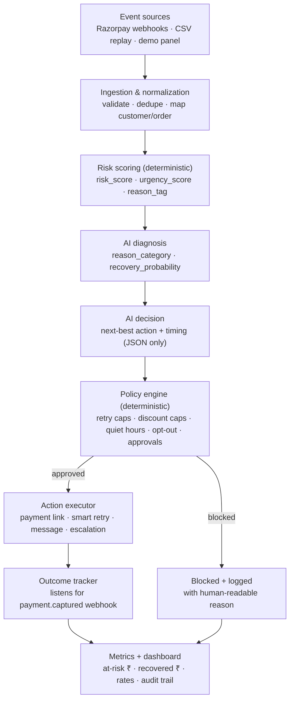
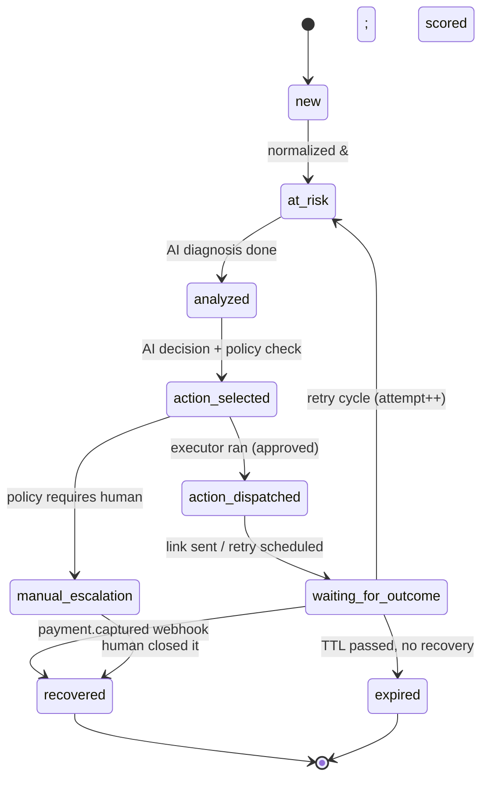

# Recoup — Architecture

> **Recoup** is a bounded AI operations system that recovers failed Razorpay payments and abandoned checkouts.
> It detects revenue at risk, diagnoses *why* it failed, decides the safest next action under hard policy limits,
> executes it (real Razorpay payment links), and proves how much money it recovered — with a full audit trail.

**Track:** AI Revenue Recovery · **Event:** Razorpay AI Buildathon 2026

---

## 1. The problem (and why it's worth an engine)

When a payment fails or a checkout is abandoned, the merchant has already earned the intent — the customer *wanted* to
pay. In India that failure is rarely "the customer changed their mind." It's usually mechanical and **recoverable**:

- a UPI collect request timed out,
- the issuing bank had a downtime window,
- a card was declined for insufficient funds at that moment,
- an OTP/3DS step was abandoned,
- an e-mandate auto-charge failed.

Each of these has a *different* correct recovery move and a *different* correct timing. Blindly retrying everything
annoys customers and burns gateway cost; doing nothing leaves real money on the table. The job is **decisioning under
constraints**, not blasting reminders.

## 2. What the demo proves in 60 seconds

1. **What revenue is at risk?** — a ranked queue of at-risk cases with a live "at-risk ₹" total.
2. **Why did the agent choose this action?** — AI diagnosis + confidence + reasoning, next to the policy checks.
3. **What did it actually do?** — a real Razorpay test-mode payment link, a scheduled retry, or a human escalation.
4. **How much did it recover?** — pay the link with a Razorpay test card → webhook fires → the case flips to
   `recovered` and the "recovered ₹" counter ticks up. **That round-trip is the thing that's expensive to fake.**

## 3. Where AI is used — and where it is deliberately *not*

This is the question a Razorpay panel will ask first: *"Why is this an LLM and not a cron job with if-statements?"*

**AI is used for judgment that rules handle badly:**

| Step | AI's job | Why not pure rules |
|------|----------|--------------------|
| **Diagnose** | Map a messy/ambiguous failure signal → `{reason_category, recovery_probability, is_auto_retriable, retry_window}` | Gateways return inconsistent, overlapping reason strings; probability depends on many soft signals |
| **Decide** | Pick the next-best action + timing to maximize *expected* recovery, within the policy envelope | The trade-off (retry vs new link vs incentive vs escalate) is contextual, not a fixed table |
| **Draft** | Write the customer-facing message for the chosen channel | Natural language generation is exactly what LLMs are for |

**AI is deliberately NOT used for** (these are deterministic code, and that separation is the point):

- storing state or moving through the state machine,
- **enforcing policy** (the policy engine can *override* the AI, never the reverse),
- moving money / creating payment links,
- computing metrics.

> **Design invariant:** the AI only ever *proposes*. A deterministic **policy engine** approves, modifies, or blocks
> every proposal, and a deterministic **executor** carries out only a fixed, allow-listed set of actions. The LLM never
> touches money and never has the final say.

## 4. System pipeline



Every arrow that changes a case writes an **audit log** row (`before_state → after_state`, actor, details).

## 5. Case state machine

A case is one recovery workflow instance for one at-risk event. It moves through an explicit, logged lifecycle — it is
never an open-ended agent loop.



Rules: every transition is logged; every action is tied to a state; invalid transitions fail loudly (they don't
silently corrupt state).

## 6. Supported events & actions (v1 scope — bounded on purpose)

**Event types:** `payment_failed`, `checkout_abandoned` *(v2: `subscription_failed`)*

**Failure reason taxonomy:** `insufficient_funds`, `card_declined`, `upi_collect_timeout`, `bank_downtime`,
`authentication_failed`, `expired_card`, `abandoned`, `unknown`

**Allowed actions (the executor will do *only* these):**

| Action | Meaning |
|--------|---------|
| `smart_retry` | Schedule a retry at an AI-chosen time (for auto-retriable failures like bank downtime / momentary NSF) |
| `send_payment_link` | Generate a fresh **real** Razorpay payment link + a drafted message |
| `send_reminder` | Nudge message, no new link (checkout abandoned, existing link still valid) |
| `offer_incentive` | Attach a small, policy-capped discount to a new link (only when EV-positive *and* allowed) |
| `escalate_to_human` | Create a manual task (high value, low confidence, or policy-required) |
| `no_action` | Do nothing this cycle (e.g. quiet hours) — still logged |

**Channels:** `email`, `sms`, `whatsapp` (message send is simulated + logged in v1; payment link is real).

## 7. Policy engine (deterministic guardrails)

Policies are config, evaluated in code, and they **win over the AI**:

- `max_retries = 3`
- `max_discount_pct = 10` (and only if amount ≥ threshold *and* EV-positive)
- `quiet_hours = 21:00–08:00 IST` → no outreach; retries still allowed
- `opt_out` → no outreach at all
- `human_approval_required` if `amount ≥ ₹25,000` **or** an incentive is proposed
- stop after `max_retries` consecutive failures
- block any action not in the allow-list

Each evaluation records which rules passed/failed and a human-readable "why blocked" string shown in the UI.

## 8. The AI contract (structured output, validated)

The LLM must return JSON matching a Zod schema. Invalid output → we log `valid=false` and fall back to a deterministic
rule. We track **JSON validity rate** as a first-class metric.

```jsonc
// Diagnosis
{ "reason_category": "upi_collect_timeout", "recovery_probability": 0.72,
  "is_auto_retriable": true, "retry_window_hours": 3, "rationale": "…" }

// Decision
{ "action": "smart_retry", "confidence": 0.81, "channel": "whatsapp",
  "requires_human_approval": false, "suggested_retry_at": "2026-08-24T15:00:00+05:30",
  "incentive_pct": 0, "reason": "auto-retriable timeout; high prior conversion" }
```

## 9. Data model (see `server/prisma/schema.prisma`)

`Merchant · Customer · Event · Case · Decision · Action · Outcome · AuditLog`

- **Money is stored as integer paise** everywhere — never floats. (₹1,499.00 → `149900`.)
- `Event` holds the raw normalized signal; `Case` is the workflow; `Decision`/`Action`/`Outcome` are the append-only
  trail of what the AI proposed, what ran, and what happened; `AuditLog` records every state transition.

## 10. Metrics (honest, including the failures)

At-risk ₹ · recovered ₹ · **recovery rate** · action success rate · policy block rate · escalation rate ·
avg time-to-recovery · JSON validity rate · a **baseline vs Recoup** before/after comparison. Blocked and unrecovered
cases are shown, not hidden.

## 11. Tech choices (rationale in [`DECISIONS.md`](./DECISIONS.md))

TypeScript end-to-end · Node/Express + Prisma + PostgreSQL · React/Vite/Tailwind/shadcn · Anthropic Claude for the AI
layer · Razorpay test-mode (Orders + Payment Links + Webhooks) · an in-process scheduler for retries (a durable queue is
the production upgrade).
