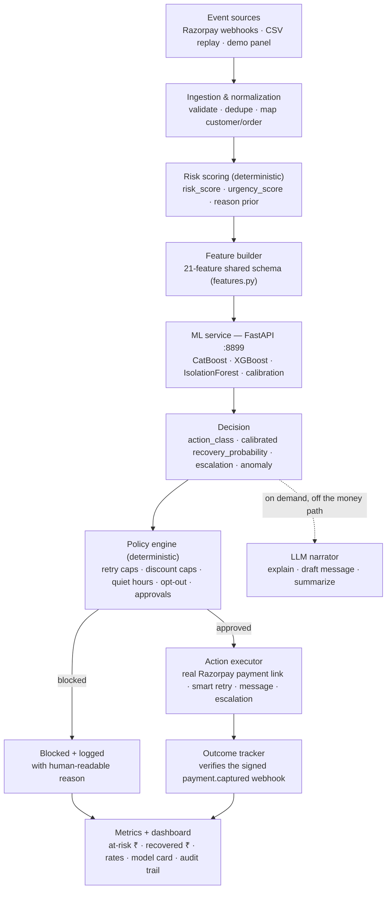
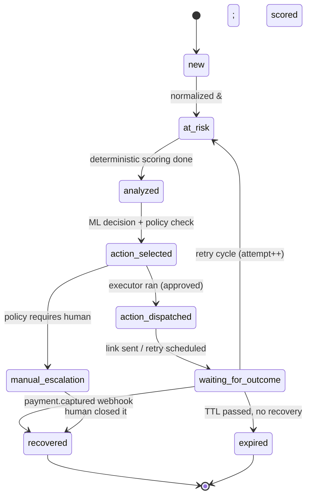

# Recoup — Architecture

> **Recoup** is a bounded, **ML-first** operations system that recovers failed Razorpay payments and abandoned
> checkouts. Tabular machine-learning models decide *what to do and how likely it is to work*; a deterministic policy
> engine + executor decide *what is allowed to actually happen*; and a signed Razorpay webhook proves how much money
> came back — with a full audit trail. An LLM is used only to explain decisions in words, never to make them.

**Track:** AI Revenue Recovery · **Event:** Razorpay AI Buildathon 2026

---

## 1. The problem (and why it's worth an engine)

When a payment fails or a checkout is abandoned, the merchant has already earned the intent — the customer *wanted* to
pay. In India that failure is rarely "the customer changed their mind." It's usually mechanical and **recoverable**:

- a UPI collect request timed out,
- the issuing bank had a downtime window,
- a card was declined for insufficient funds at that moment,
- an OTP/3DS step was abandoned,
- an e-mandate auto-charge failed.

Each of these has a *different* correct recovery move and a *different* correct timing. Blindly retrying everything
annoys customers and burns gateway cost; doing nothing leaves real money on the table. The job is **decisioning under
constraints** — a ranking-and-classification problem, not a language problem.

## 2. Who is this for (target segment)

Recoup is built for **mid-market Indian D2C / subscription merchants processing roughly ₹50L–₹5Cr/month on Razorpay**
— large enough that 1–2 recovery points is real money (₹1–10L/month), too small to staff a data-science team or a
recovery ops desk. They already get Razorpay's built-in **retries + Payment Links + dunning**, but those are
*merchant-configured, static rules*. Recoup is the decision layer on top: it learns *which* recovery move fits *which*
failure for *this* merchant, stays inside hard guardrails, and shows the recovered-rupee proof a founder can trust.

## 3. What the demo proves in 60 seconds

1. **What revenue is at risk?** — a ranked queue of at-risk cases with a live "at-risk ₹" total.
2. **What did the model decide, and how sure is it?** — the six ML outputs (recovery probability, chosen action,
   escalation risk, anomaly score, action confidence, reason) next to the policy checks.
3. **What did it actually do?** — a real Razorpay test-mode payment link, a scheduled retry, or a human escalation.
4. **How much did it recover?** — pay the link with a Razorpay test card → **signed webhook** fires → the case flips to
   `recovered` and the "recovered ₹" counter ticks up. **That round-trip is the thing that's expensive to fake**
   (see [`WEBHOOKS.md`](./WEBHOOKS.md) — it ships with an all-green signed self-test).

## 4. Where ML decides — and where the LLM is deliberately kept out

This is the question a Razorpay panel will ask first: *"What is the AI actually doing here?"*

**Machine learning owns the decision.** Every at-risk case is scored by a tier of tabular models over a shared
**21-feature** schema (the recovery head appends the candidate action, so it sees 22 columns). The models produce the
six outputs the pipeline acts on:

| Output | Model | Meaning |
|---|---|---|
| `recovery_probability` | CatBoost → **isotonic-calibrated** | P(this case is recovered) — a *calibrated* probability, safe to threshold and to feed EV math |
| `action_class` + `per_action_recovery` | CatBoost multiclass | The next-best action, and the modelled recovery odds of each allowed action |
| `action_confidence` | CatBoost softmax (uncalibrated) | How peaked the action distribution is — a *relative* confidence, **not** a calibrated probability |
| `escalation_probability` | CatBoost → sigmoid-calibrated | P(this case needs a human) |
| `anomaly_score` | IsolationForest | How unusual this case is vs. the learned normal |
| `reason_tag` | CatBoost / taxonomy | The normalized failure reason |

**The LLM never decides.** It is called only, and only on demand, to:

- **explain** a decision in plain English for the case drawer,
- **draft** the customer-facing message for the chosen channel,
- **summarize** an escalation for the human who picks it up.

If the LLM is down or returns junk, these fall back to templates — and *nothing about the money path changes*, because
the money path never depended on it.

> **Design invariant — "ML proposes, deterministic code disposes."** The models only ever *propose*. A deterministic
> **policy engine** approves, modifies, or blocks every proposal, and a deterministic **executor** carries out only a
> fixed, allow-listed set of actions. No model — tabular or language — touches money or has the final say.

Why ML and not "a cron job with if-statements": the mapping from *(failure reason × amount × customer history × timing
× channel)* to *the recovery move with the highest expected return* is contextual and merchant-specific. A static rule
table encodes one person's guess once; a calibrated model learns it from outcomes, quantifies its own uncertainty, and
improves as real recovery data replaces the synthetic bootstrap. That is exactly the surface Razorpay's static
retry/dunning toggles leave on the table (see §12).

## 5. System pipeline



If the ML service is unreachable, `decideCase` falls back to a deterministic rule-based plan so the pipeline never
stalls — the fallback is flagged as `source: 'fallback'` on the prediction, and the policy + executor still run.

Every arrow that changes a case writes an **audit log** row (`before_state → after_state`, actor, details).

## 6. Case state machine

A case is one recovery workflow instance for one at-risk event. It moves through an explicit, logged lifecycle — it is
never an open-ended agent loop.



Rules: every transition is logged; every action is tied to a state; invalid transitions fail loudly (they don't
silently corrupt state).

## 7. The ML tier (`ml/`)

A separate Python service so the models are trained and served with the right tools, and the money path stays in typed
TypeScript.

- **Primary decision model — CatBoost.** Chosen for native categorical handling (failure reason, method, channel,
  merchant type — no leakage-prone one-hot encoding) and strong calibration out of the box.
- **Benchmark — XGBoost**, and a **LogisticRegression baseline**. All three are trained and reported side by side so
  the model choice is defended with numbers, not asserted.
- **Calibration — `CalibratedClassifierCV`** (isotonic, on a held-out split via a frozen prefit estimator) turns the
  recovery score into a probability whose predicted rate matches the observed rate — the reliability curve is shown on
  the dashboard model card.
- **Anomaly — `IsolationForest`**, both per-case (is *this* case unusual?) and windowed with per-reason z-scoring
  (is there a *failure spike* — e.g. a bank-downtime incident — happening right now?).
- **Training data — a synthetic "world model"** (`ml/src/worldmodel.py`): 30k cases with a reason×action fit matrix,
  EV-based labels, deliberately **noisy** per-action outcomes, and injected incident windows. It is a documented
  bootstrap, not a claim of real data — the honest limitation, and the thing real merchant outcomes replace.

Feature schema lives in `ml/src/features.py` and is the **single source of truth** shared by training and serving, so
train/serve skew can't creep in.

## 8. The ML contract (validated, honestly labelled)

The TypeScript side calls the ML service and persists exactly these outputs per case. Two labelling honesties are baked
in on purpose:

- `recovery_probability` is the **isotonic-calibrated** number — the one that is safe to threshold or put in EV math.
- `action_confidence` is the action head's **uncalibrated softmax** — a *relative* confidence, not a probability. It is
  named `action_confidence` (not "calibrated confidence") in the API, the database column, and the UI, so a
  code-reading reviewer never finds an uncalibrated value hiding in a "calibrated" field.

```jsonc
{
  "recovery_probability": 0.30,        // calibrated P(recovered)
  "action_class": "send_payment_link",
  "action_confidence": 0.89,           // uncalibrated softmax (relative)
  "escalation_probability": 0.18,      // sigmoid-calibrated
  "anomaly_score": 0.39,
  "reason_tag": "card_declined",
  "per_action_recovery": { "smart_retry": 0.21, "send_payment_link": 0.30, "…": 0.0 },
  "model": { "version": "20260824-1643" }
}
```

## 9. How good are the models — and how we say so honestly (see the dashboard model card)

All metrics are on a **time-ordered** held-out split (train on the earlier days, test on the latest ~20% by
`day_index`), so nothing below is inflated by temporal leakage — see `ml/src/train.py` and `ml/src/eval.py`.

- **Recovery (the number that matters): CatBoost calibrated ROC-AUC ≈ 0.75**, 95% bootstrap CI ≈ [0.735, 0.760].
  CatBoost's edge over the LogisticRegression baseline is **real but small** (paired-bootstrap median ≈ +0.010, CI
  excludes 0) — so the model card states plainly that CatBoost is primary for **calibration + native categoricals**,
  not a headline AUC gap. The reliability curve is plotted predicted-vs-observed. (On a *random* split the AUC reads
  ≈0.76; the time-ordered split is honestly a hair lower — that gap is the leakage we removed.)
- **Action head:** raw accuracy ≈ **70%** on *deliberately noisy* labels — i.e. a genuine learning problem, not the
  tautology it would be if labels were the argmax of a clean formula. The meaningful metric is **agreement with the
  EV-optimal action ≈ 84%**; both are shown, with the noisy-label caveat.
- **Escalation:** calibrated, Brier ≈ 0.07.
- **Failure-spike (windowed anomaly) detection ≈ 87.5%** on injected incidents.

### Recovered ₹ versus *what?* — the counterfactual holdout (`ml/eval.py`)

A gross "money recovered" number on a simulator you wrote proves nothing. So the eval rolls four **arms** over the
time-ordered holdout and scores each with the *world's independent ground-truth* recovery mechanism (not the model's
own prediction — that's the anti-circularity guard), reporting incremental lift with 95% bootstrap CIs. And to make
sure the eval isn't just flattering itself, we run it against **two independently-authored worlds** — the reason we can
say *when* the ML earns its keep instead of asserting it:

| Arm (net recovery rate) | World A — reason-dominated (`ml/eval.json`) | World B — context-driven (`ml/eval_v2.json`) |
|---|---|---|
| do-nothing | 6.4% | 9.1% |
| **rules-only** (reason triage) | **38.3%** | **26.8%** |
| **ML + policy** (deployed) | **38.3%** | **37.3%** |
| oracle (best action) | 38.6% | 43.1% |
| **ML lift over rules-only** | **−₹6k · CI crosses 0 · a tie** | **+₹5.49M · CI [5.1M, 5.8M] · significant** |
| capture of oracle headroom | ~99% | ~83% |

Read honestly: in **World A** the best action is ~entirely a function of the failure reason, so a rules baseline is
already near-optimal (it captures ~99% of the oracle headroom) and the ML **ties** it — we show the tie rather than
hide it. **World B** is authored independently (`ml/src/worldmodel2.py`) with a different mechanism: the best
action is driven by a **latent customer archetype** that leaks into observable features, so a reason lookup predicts it
only **~24%** while the archetype predicts it **~85%**. There, the ML — which reads those features — **beats the rules
baseline by +₹5.49M (significant)**. The takeaway is the honest, now-demonstrated claim: **the ML's edge over rules
scales with how much the optimal action depends on context beyond the failure reason** — and real merchant recovery is
context-driven, not a clean lookup, which is exactly what the synthetic→real data flywheel (ADR-012, ADR-015) is built
to capture. Either way the ML also earns its place on calibration, per-case uncertainty, and governance.

Unrecovered, blocked, and escalated cases are shown on the dashboard, not hidden.

## 10. Policy engine (deterministic guardrails)

Policies are config, evaluated in code, and they **win over the model**:

- `max_retries = 3`
- `max_discount_pct = 10` (and only if amount ≥ threshold *and* EV-positive)
- `quiet_hours = 21:00–08:00 IST` → no outreach; retries still allowed
- `opt_out` → no outreach at all
- `human_approval_required` if `amount ≥ ₹25,000` **or** an incentive is proposed
- stop after `max_retries` consecutive failures
- block any action not in the allow-list

Each evaluation records which rules passed/failed and a human-readable "why blocked" string shown in the UI.

## 11. Data model (see `server/prisma/schema.prisma`)

`Merchant · Customer · Event · Case · Prediction · Decision · Action · Outcome · AuditLog` — plus `ModelRun` and
`AnomalyFlag` for the ML tier.

- **Money is stored as integer paise** everywhere — never floats. (₹1,499.00 → `149900`.)
- `Event` holds the raw normalized signal; `Case` is the workflow; **`Prediction`** is the append-only record of the
  six ML outputs per run; `Decision`/`Action`/`Outcome` are the trail of what was chosen, what ran, and what happened;
  `AuditLog` records every state transition.

## 12. Doesn't Razorpay already do recovery? (Agent Studio, the Intelligent Retry Engine, …)

Yes — and well. Razorpay ships first-party recovery products a merchant can turn on today: **Agent Studio's
Subscription Recovery and Abandoned Cart Conversion agents** (early access since Mar 2026, built on Anthropic's Claude
Agent SDK), the **Intelligent Retry Engine** (WhatsApp nudges for failed autopay debits), the **RazorpayX Receivables
Agent** (invoice follow-up, Jun 2026 beta), **Optimizer** (enterprise ML routing on 150+ parameters) and **Vulcan**
(the payments foundation model, Aug 2026). Recoup does **not** compete with these. It *uses* Razorpay's Payment Links,
retries and webhooks as execution primitives, and is built to **plug under** those agents. What it adds is the
**measurement-and-governance layer** none of them publish:

| | Agent Studio · Intelligent Retry Engine · Optimizer | Recoup (plugs under them) |
|---|---|---|
| Recovery measurement | Recovery rates not published; no public holdout | **Holdout-measured incremental** ₹ recovered per batch, net of cost |
| Per-case certainty | Not surfaced | **Calibrated** recovery probability + escalation risk + anomaly score |
| Triage before the model | Model / agent-led end to end | **Deterministic error-reason triage + risk scoring** run *before* any model |
| India policy | Not exposed | **Policy-as-code** — retry caps, IST quiet hours, opt-out, ₹-threshold approvals — enforced in the money path (§10) |
| When to *stop* / escalate | Fixed caps | EV- and confidence-aware, inside hard policy caps |
| Incident awareness | Enterprise (Optimizer) | Windowed anomaly detection flags a live bank/UPI failure spike |
| Proof | Merchant reads reports | Signed-webhook `recovered ₹` with a full **append-only audit trail** |

Recoup is not a payment gateway or a rival to Agent Studio, and doesn't try to be. It's the thin, auditable brain that
decides how to *use* those recovery tools well and **proves** what they brought back — the measurement, triage and
governance layer they leave on the table.

## 13. Tech choices (rationale in [`DECISIONS.md`](./DECISIONS.md))

TypeScript money path — Node/Express + Prisma + PostgreSQL (embedded, no Docker) · React/Vite/Tailwind dashboard ·
**Python ML tier — FastAPI + CatBoost + XGBoost + scikit-learn** · Razorpay test-mode (Orders + Payment Links +
Webhooks) · provider-agnostic LLM (OpenAI-compatible or Anthropic) used only for narration · an in-process scheduler
for retries (a durable queue is the production upgrade).
